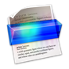

  

<h1 align="center" style="margin-top: 0px;">OCR NOTES COMPANION</h1>

IOS app for taking quick notes using the camera and saving them as PDF, along with the text detected

  
   
  

## Overview

- Note: Inspiration taken from the WWDC keynote [WWDC 2019 Session 232: Advances in Natural Language Framework](https://developer.apple.com/videos/play/wwdc2019/232/).
- Planning to expand it to export information in a spreadsheet (csv)
- More Work can be seen in the [WWDC 2020 Session 657: Make apps smarter with Natural Language](https://developer.apple.com/videos/play/wwdc2020/10657)
- **Click this [ to get full app recording video on YouTube 🎥 :**

